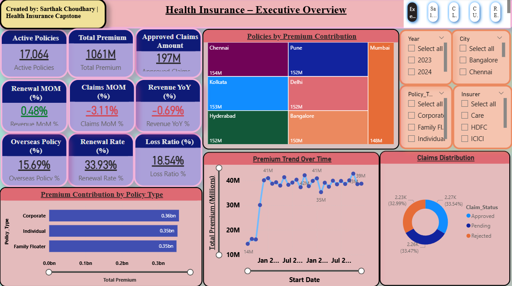
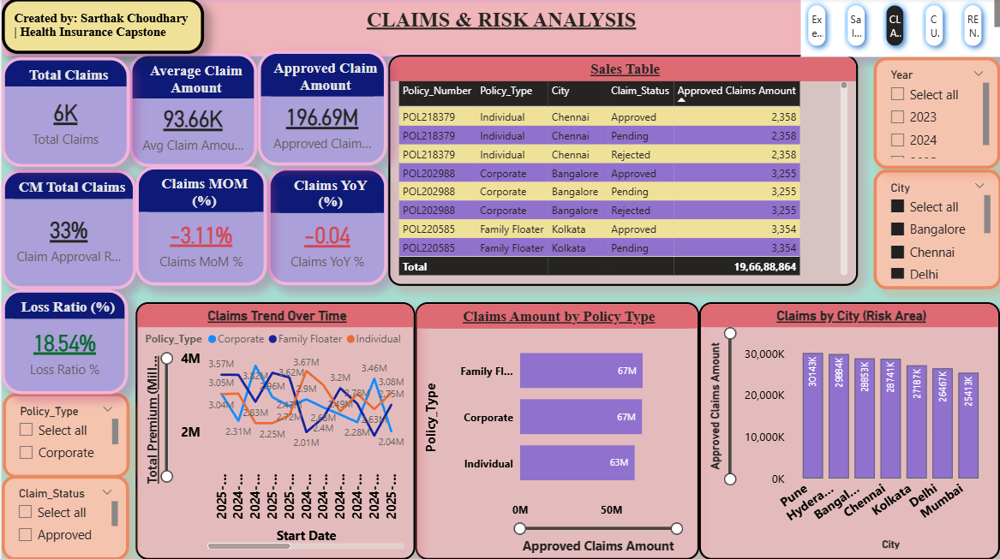
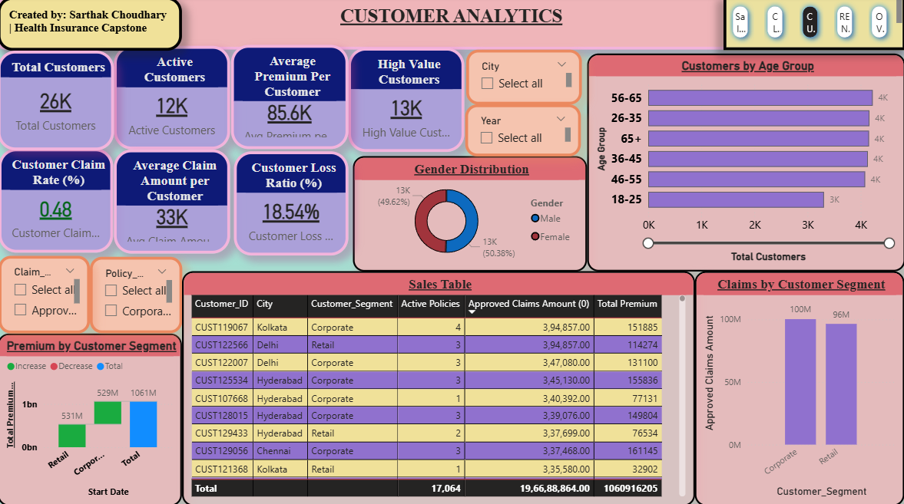

# health-insurance-analytics
# 🏥 Health Insurance Analytics

💼 This project is part of my Data Analyst Portfolio

## 📌 Overview
Analyzed health insurance data to identify insights on revenue, claims, customer risk, and renewal behavior.

## 🛠️ Tools Used
- SQL (MySQL)
- Python (Pandas)
- Power BI

## 📊 Key Insights
- Premium revenue > 1061M
- Loss ratio: 18.54%
- Renewal rate: ~34%
- High-risk cities & customers identified

## 📸 Dashboard Preview

### Executive Dashboard

### Claims Analysis

### Customer Analytics

## 📂 Files Included
- SQL Queries
- Power BI Dashboard
- Dashboard Screenshots

## 🚀 Business Impact
- Identified high-risk segments
- Improved decision-making capability
- Highlighted retention challenges
